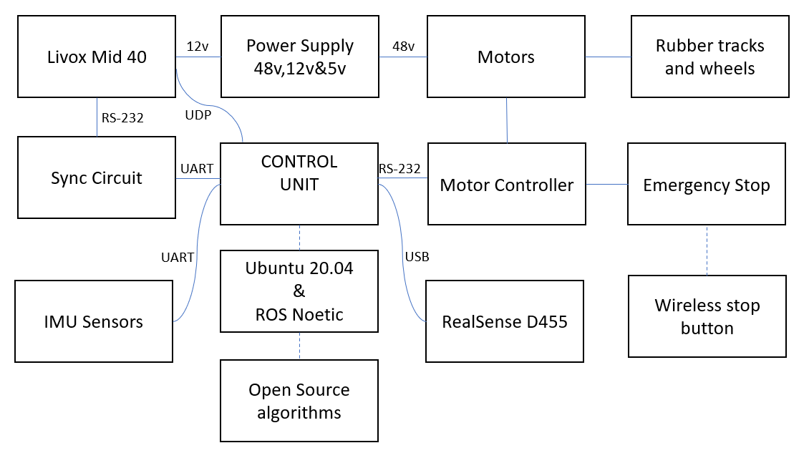

# Project VineBot

 

VineBot is a field robotic platform designed for off-road, rough terrain environments, It is being developed from scratch at the Centre Robotics and Intelligence (CERI) department of Technical University of Applied Sciences Würzburg-Schweinfurt by a team of students. The VineBot is designed to automate agricultural tasks to aid farmers in viticulture. The VineBot can be equipped with a multitude of sensors and actuators like RGBD cameras, 3D LiDARs, GPS, IMU wheel encoders, motors, motor controllers, and various other tools to aid in tasks like autonomous navigation, ploughing, pesticide application, irrigation, and crop growth monitoring.

# Vinebot_noetic_packages
ROS packages developed for the vinebot, it includes updated versions of Vinbot_ros_packages, realsense ros wrapper, livox ros wrapper, and mapping packages and some additional packages. 
Prerequisites and dependencies 
before installing the catkin workspace some additional libraries and dependencies are required.

ros noetic installation:  § sudo apt install ros-noetic-desktop-full

Pcl :                     $ sudo apt install libpcl-dev  pcl-tools

Eigen:                    $ sudo apt install libeigen3-dev 

opencv:                   $ sudo apt install libopencv-dev python3-opencv

ddynamic_reconfigure:     $ sudo apt install ros-noetic-ddynamic-reconfigure

rtabmap and rtabmap-ros : $ sudo apt install ros-noetic-rtabmap ros-noetic-rtabmap-ros

joystick driver:          $ sudo apt install ros-noetic-joy

ds4drv:                   $ sudo pip install ds4drv

# LIVOX SDK Installation: 

the livox sensor requires Livox SDK a software development kit developed by livox for the communication between livox mid 40 and ros.

The package can be installed form the git hub repository provided by livox, detailed installation instructions are provided by livox in the git hub repository.

Livox SDK: https://github.com/Livox-SDK/Livox-SDK

# Realsense2 sdk Installation:
detailed instructions can be found here(excluding jetson devices) : https://github.com/IntelRealSense/librealsense/blob/master/doc/distribution_linux.md

for jetson devices refer the following link and follow the debian package installation guide.
https://github.com/IntelRealSense/librealsense/blob/master/doc/installation_jetson.md

# Make catkin workspace if does not exist and clone this repo

mkdir -p ~/catkin_ws/src

cd ~/catkin_ws/src

git clone 

# Install all dependecies

cd ..

rosdep install --from-paths src --ignore-src -r -y

(only for jetson xavier nx) for the realsense camera to function with ros the cmakelist.txt file of realsense2_camera in realsesne-ros package must be modified as per the instructions from the following link:
https://github.com/IntelRealSense/realsense-ros/issues/2326#issuecomment-1107658481
# Udev Rules 
This package is binding the USD devices under static name, so you can install the udev rule to identify the device as given in launch files. In order to do so edit /etc/udev/rules.d/10-local.rules file under root user:

$sudo su root 
$nano /etc/udev/rules.d/99-usb-serial.rules
#add the following line inside the file 
SUBSYSTEM=="tty", ATTRS{idVendor}=="067b", ATTRS{idProduct}=="23f3", SYMLINK+="roboteq"
SUBSYSTEM=="tty", ATTRS{idVendor}=="067b", ATTRS{idProduct}=="2303", SYMLINK+="imu"
#now reload the rules files using the following code 
$sudo udevadm control --reload-rules && udevadm trigger
Troubleshooting:

If you do not have the permission to open the serial port, try to read this article https://websistent.com/fix-serial-port-permission-denied-errors-linux/

# Compile package
change to your catkin_ws folder 
catkin_make

echo "source ~/catkin_ws/devel/setup.bash" >> ~/.bashrc

source ~/.bashrc

# Operating the vinebot:
the vinebot runS on Linux based system (Ubuntu 20.04) and uses ROS noetic for the pacckage integration and it is ecquipped with various sensors and actators. the Vinebot uses a generic version of Roboteq dual motor controller(HBL2350) to control Dual DC servomotors. The motor controller is capable of accepting commands from PC/ microcontroller via USB port and using the protocol RS-232 with support for analog and digital I/O capabilities. Figure 1 depicts the system overview  and layout of the vinebot.

Figure 1: layout of the robot. 

# bring_up launch files: 
In order for the vinebot to navigate effiently a set of bring_up launch files are created, different bringup launch files have different functionalities, most customized bringup files follow the base file "bringup.launch" in "Vinebot_ROS_Packages/roboteq_control/launch/" folder.
Bringup.launch file launches multiple nodes at the same time,namely the motor controller node, the urdf node, and the imu node.
an advanced version of the bringup.launch file called as bringup_rtab_imu.launch can be used for the localization and mapping of the environment using RTAB MAP, REALSENSE D455, bno 055 IMU, and EKF  based localization filter, this paticular Launch file also utilizes the IMU data provided by the IMU sensor interated into the Depth camera.

# Roboteq Motor controller:
The dual DC motors require 48v(DC) to operate and are controlled by a generic version of the roboteq motor controller, the motor controller communicates with the operating system via USB port. the ros launch file  "differential_drive.launch "  from Vinebot_ROS_Packages/roboteq_control/launch/differential_drive.launch launches the node that can be used to send commands to the motor controller. in order for the differential_drive.launch file to recogonize the serial port of the USB connceted to the motor controller a set of udev rules must be approved. The pocedure to update the udev rules is provided in the udev rules section.
A short description of the motors is given below, and Figure 2 depicts the motor controller with some other components.

Description Specification
Operation Voltage 48V
Output power 400W each
Rated current 8-10A
Peak Torque from the motor 15Nm
Rated RPM from the gearbox 100-200 RPM
Max velocity 6 km/h
Climbing slope 45 degrees

Figure 2: 1.- DC power source from the batteries (48v), 2.-Motor Controller, 3.- 48v to 5v DC to DC converter, 4.- 48v to 12v DC to DC converter, 5.- BNO055 IMU Sensor and 6.- Wireless Emergency stop. 

# Robot model - the URDF file of the Vinebot.
URDF is an XML format for representing a robot model. THE urdf file contains the necessary joints, links and apprppriate TF transform required for the representation of the Vinebot in ROS. Vinebot_ROS_Packages/vinebot_decription/urdf contains the various xacro files that define the robot model in RVIZ.  The file "display.launch" from Vinebot_ROS_Packages/roboteq_control/launch is used in the bringup.launch files to display the vinebot, it utilizes  "differential-robot.urdf.xacro" a simplified file used for the drive of the robot is provided in the "Vinebot_ROS_Packages/roboteq_control/urdf" to represent the vinebot.

# BNO 055 9 DOF IMU Sensor:
BNO 055 is one of the IMU sensors that are being utlized in the vinebot, it is located at the rear of the vinebot(figure 2). some of its specifications are listed below:
The BNO055 can output the following sensor data:

Absolute Orientation (Euler Vector, 100Hz) Three axis orientation data based on a 360° sphere
Absolute Orientation (Quatenrion, 100Hz) Four point quaternion output for more accurate data manipulation
Angular Velocity Vector (100Hz) Three axis of 'rotation speed' in rad/s
Acceleration Vector (100Hz) Three axis of acceleration (gravity + linear motion) in m/s^2
Magnetic Field Strength Vector (20Hz) Three axis of magnetic field sensing in micro Tesla (uT)
Linear Acceleration Vector (100Hz) Three axis of linear acceleration data (acceleration minus gravity) in m/s^2
Gravity Vector (100Hz) Three axis of gravitational acceleration (minus any movement) in m/s^2
Temperature (1Hz) Ambient temperature in degrees celsius 

for more information about the IMU sensor refer: https://www.adafruit.com/product/2472

the IMU communicates with the operating system via an UART to USB converter. a modification of the USB serial port is required for the ROS packages to recogonize the data from the IMU,an Udev rule is defined,The pocedure to update the udev rules is provided in the udev rules section. THE imu data can be accessd and used by utilizing "imu.launch" from "Vinebot_ROS_Packages/ros_imu_bno055/launch" folder and "ros_imu_bno055" package.
# Realsense D455
RealSense D455 is the depth camera used in this project the camera is mounted at the front of the vehicle, the camera can be used for various purposes like mapping, navigation, object detection and much more. a brief description of the cameras specification is given below:

Specification
Depth FOV: 87°(H)x58°(V)x 95°(D)

Colour camera FOV: 90°(H)x63°(V)x 98°(D)

Ideal Range: 0.4m to 6m

Output Resolution (Depth): Up to 1280x720

Output Resolution (RGB): Up to 1280X800

Integrated IMU: Bosch BMI055

Connector: USB-C

For additional information about RealSense D455 refer: https://www.intelrealsense.com/depth-camera-d455/

 The camera uses USB to communicate with the operating system. the integration of the camera into ros and the operating system requires a set of libraties provided by RealSense which can be installed by following instrucions provided in the  Realsense2 sdk installation section. The ROS package realsesne-ros can be use to access the camera data,there are various launch files in the launch folder  located at "realsense-ros/realsense2_camera/launch". the launch file "realsense-ros/realsense2_camera/launch/rs_camera_imu.launch" launch the node that publishes camera data as well as the data from the IMU integrated into the camera.     Figure 3 depicts the front view for the vinebot with RealSense D455 and Livox Mid-40.
 
 

Figure 2:Vinebot front view 1.- Livox Mid-40 and 2.- RealSense D455   

# Livox Mid 40
Livox mid 40 is the depth lidar used in this project, it is mounted above the camera on a 3D printed stand. the Mid 40 is a powerful sensor capable of scaning upto 260 m. The Mid 40 has one disadvantage, although it has a range of 260 m, it cannot detect objects within 1 m and so the Mid 40 must be placed appropiately. The Lidar is generally suitable for exterior environments and it is capable of generating accurate maps of the environment. some of the specifications of Livox Mid 40 are listed below. 
Specification

FOV: 38.4° (circular)

Max detection Range: 260 m

Laser wavelength: 905 nm

Point rate: 1,00,000 points

Beam divergence: 0.28°(V*) x 0.03°(H)

voltage range: 10-16 V (DC)

Power: 10W-40W

A DC-DC converter that converts 48V DC to 12.5 v DC is used to generate the necessary voltage required for the sensor to operate, the converter is depicted in figure 2 ( part number:3). To establish comminication between ROS and the sensor Livox SDK and livox ros driver are required. Livox SDK is the software delelopment kit provided by Livox, it is the communication protocol developed by Livox, it is used to communicate with all Livox devices and to generate pointcloud from the sensors. more information on Livox SDK can be found in : https://github.com/Livox-SDK/Livox-SDK 

Livox-ros-driver is the ros package developed by Livox for the integration of livox based sensors into ROS more information about the package can bae found here: https://github.com/Livox-SDK/livox_ros_driver. 

Livox_ros_driver requires Livox SDK to operate, the ros driver also requires a time synchronization method foe better operation of Livox_ros_driver, Livox suggests the usage of GPS based time synchronization method for optimum results. detailed information about time synchronization can be found in the following link: https://github.com/Livox-SDK/Livox-SDK/wiki/livox-device-time-synchronization-manual.  

The Launch folder "ws_livox/src/livox_ros_driver/launch" of Livox_ros__driver has a variety of packages, for instance the package Livox_Lidar_rviz.launch file launches RVIZ with point cloud visualization from livox mid 40. In order to establish connection between Livox Mid 40, Time-Synchronization circuit and ROS the Config file "livox_lidar_config.json" from "ws_livox/src/livox_ros_driver/config" folder must be updated with the LIDAR's Broadcasting Number which can be obtained by utilizing Livox-Viewer. Once the Broadcast number is added Time Synchronization must be enabled and the port which connects the Time-Synchronization circuit with the the Microcontroller or PC must be mentioned. Figure 3a depicts a sample broadcast code configuration file for the Livox Mid 40, andfigure 3b depicts a sample time synchronisation configuration for the Mid 40.

 

Figure 3a: "livox_lidar_config.json" broadcast configuration, enable connect connects the LIDAR to ROS

Figure 3b "livox_lidar_config.json" time sync configuration, Enable TimeSync and set Time circuit Port

# RTAB-MAP:
RTAB-Map (Real-Time Appearance-Based Mapping) is a RGB-D, Stereo and Lidar Graph-Based SLAM approach based on an incremental appearance-based loop closure detector. The loop closure detector uses a bag-of-words approach to determinate how likely a new image comes from a previous location or a new location. more information about RTABMAP can be found from https://introlab.github.io/rtabmap/ 

the ROS page of RTAB-MAP can be found from https://github.com/introlab/rtabmap_ros .

RTAB-MAP can be installed using vaious methods, but the simplest method to install RTAB map is through ROS binaries.

i.e. $  sudo apt install ros-$ROS_DISTRO-rtabmap*  

the launch files of RTABMAP are stored in the "/opt/ros/noetic" folder. A simplified version of the launch file(realsense-ros/realsense2_camera/launch/opensource_tracking.launch) to launch RTAB-MAP is proveded in the "realsense-ros/realsense2_camera/launch" folder. the latest version of the launch file with updated parameters is realsense-ros/realsense2_camera/launch/opensource_tracking_vinebot_imu.launch located in the same folder.
The map is stored in the form of .db file which can be found in the hidden .ros folder of the home directory. A new map is created everytime the opensoucetracking.launch file is launched,the map is stored in the rtabmap.db file. this file is necessary for the localization mode of RTABmap. The Localization mode can be accessed in two ways,one during the mapping and one after the map is created and the nodes are closed. rosservice  commands can be used to change between mapping and localization such that,

 $ rosservice call /rtabmap/setmodelocalization
 
 $ rosservice call /rtabmap/setmodemapping
 
 The launch file to start the vinebot in loclization mode, provided an rtabmap.db file is available in the .ros folder, is located in the "realsense-ros/realsense2_camera/launch" folder.the launch file realsense-ros/realsense2_camera/launch/opensource_tracking_vinebot_localization_imu.launch  launches the latest verison of the localization node. 
 In order to view and optimize an previously created map, rtabmap-databaseViewer can be used in the folder of the .db file.

 $ ratbmap-databaseViewer rtabmap.db
 

#  Hardware Setup: 
The BLACKSTONE TB 4500 E (AGRIEURO, n.d.) acts as the base of the robotic platform. Two caterpillar rubber tracks connected to two DC brushless motors enable the VineBot to move in rough terrain, each motor requires 48v to operate at 400W, and the motors can achieve a maximum velocity of 6 Km/h. The motors are controlled by Roboteq’s Dual Channel motor controller Roboteq HBL2350. The motor controller receives digital / analog commands from the PC or the microcontroller through a USB port via RS-232 protocol. The two-wheel encoders, mounted behind the motors count the number of rotations made on each wheel and send raw wheel odometry data through HBL2350 controller. Two IMU sensors, the Tinkerforge IMU Brick 2.0 and the Adafruit BNO055 are mounted on the front and back side of the VineBot. The IMU sensors measure and improve the odometry of the VineBot and are also used for localization of the VineBot. Four 12v rechargeable batteries are used as the power source for the VineBot, additional step-down transformers are used to convert 48v DC to 5v DC for the Raspberry Pi/Jetson Xavier and 48v DC to 12v DC for the LiDAR. F 21 E1 RX, a wireless crane remote control, is used as an emergency brake for the VineBot.

#  Power supply and charging
the vinebot requires 48v to operate which is provided by four 12v batteries below the setup shown in figure 2. the 48 v from the batteries is connceted to the motor controller to supply power to the motors and the motor controller. two  DC to DC step down converters are used to convert 48v to 5v and 12 v respectively as shown in figure 2. To charge the btteries efficiently a battery equalizer is connected to the batteries. 
the Vinebot can be connected to the power supply by joining the power cables behind the vinebot as shown in figure 4.

Figure 4 "Vinebot rear ", connect 1 with 2 to close the circuit.

charging of the vinebot requires an external charger, in order to efficiently charge the batteries it is adviced to set the voltage at 48v and the current value at low(3A -4A)  as shown in figure 5a. once the values are set and the vinebot is connceted to the power supply, the charging cable can be inserted into the charging port which is located on the left side of the vinebot as shown in figure 5b.

Figure 5a "Battery charger "1- power switch, 2 - ampire control, 3- voltage control and 4 charging cable.

Figure 5b charging port,  charging cable from figure 5a should be connceted here. 

Figure 5c battery status indicator. 

The suffient charge required for the batteries is shown in figure 5c.
if the batteries go below the suffient charge (red zone from figure 5c) they would go into deep discharge mode and the batteries would not be charged, if such sitiation arises than the voltage and current  from figure 5a should be set as 48VH and medium to high current value respectively, it is advised not to charge the vinebot with higher values for more than 5 minutes as these  values are used to bring the batteries out of deep discharge mode and prolonged charging of the betteries with higher values might damage the batteries permanantly. Once the batteries are out of deep discharge mode they can be charged usin the normal charging procedure.

# Emergency stop 
F 21 E1 RX, a wireless crane remote control is the emergency brake. more information about the emergency brake can be found from https://www.telecrane.com/product-info.asp?id=201 .
the emergency brake consists of two main modules, the brake moodule directly connected to the motor controller as shown in figure 2, and two wireless remote controllers. The VineBots movements could be halted using the emergency brakes when applied, to apply the emergenct brake simply press the red button on the wireless controller(figure 6) to stop the vinebots movements. In order to the release the brakes twist the red knob, and press the green button in the emergency brakes,as shown in figure 6,for the vinebot to move both the wireless brakes must be released.

Figure 6 Emergenct stop remote controller , 1- Red Button (to stop the movement), To release the brake twist the red  button (1) and press the green button(2). 

# PS4 
The vinebot can be controlled using a ps4 joystick. ROS requires a couple of nodes additional to the ps4 ros package (Vinebot_ROS_Packages/ps4-ros) which can be installed using the following commands.

joystick driver:          $ sudo apt install ros-noetic-joy

ds4drv:                   $ sudo pip install ds4drv

in order to use the joystick with ROS it must be paired before starting the launch files,  press the Playstation button + share button for ~5 sec this will put the joystick in pairing mode once the joystick is in pairing mode conncet it to the PCor the microcontroller with the ROS code. 
Once the Joystick is paired, it connects to the microcontroller automatically.

*Note: The joystick's ros node and other steps must be started after the "bringup.launch" files are called.
once the bringup-launch files to drive the vinebot are launched 
the following steps must be followed. 
(starting the node for the first time)
 *(requires password)$ sudo su root 
 
open ds4drv:                                                                 $ ds4drv

register the device in most cases X is  1                                $ sudo chmod a+rw /dev/input/jsX

the registration process must be done once. after the device is registered the following steps mut be followed. 

Set the parameter value as  so the ros node knows which device it should use  $ rosparam set joy_node/dev "/dev/input/jsX"

 start the joystick node                                                      $ rosrun joy joy_node

 start the ps4 node                                                           $ rosrun ps4_ros ps4_ros

the following steps are summarized and created in a shell script which is "/shell scripts and instructions/startjoystick.sh" .
the joystick number defined here is js1 if the joystick is not registering as js1 then the parameter value must be chaanged to the device number the joystick is  registered.

Once the joystick is calibrated the keys used to move the vinebot are listed below, or better understanding refer figure 7, where the layout of the joustick is showm.

L2-Accelerate/move forward
R2-decelerate/move backward
L knob - lean left to turn left, lean right to turn right
L2+X - turbo acceleration 
R2+X - turbo acceleration (reverse direction)
Square button- Brake 

note using the turbo acceleratio for prolonged mode indoors might cause injury as the joystick waits for the time cycle to end and it might take additiona seconds to sotp the vinebot.

Figure 7 Layout of the joystick.

# launch instructions 

to launch vinebot with rtabmap in the mapping node with ekf filter based fused localization

$ roslaunch roboteq_control bringup_rtab_imu.launch 

to move the vinebot using the keyboard:

$ rosrun  teleop_twist_keyboard teleop_twist_keyboard.py 

to move the vinebot using the shell scripts open a terminal in the folder with the shell shripts (shell scripts and instructions)

§ sudo ls

§ ./startjoystick.sh

 this step must be performed after the bluetooth joystick is connected to the operating system and the bringup file is launched 

to launch vinebot with rtabmap in the localization node with ekf filter based fused localization note that this step requires a previously created map in .db format 

$ roslaunch roboteq_control bringup_rtab_localization_imu.launch 

# Additional Instructions

to update and upgrade the packages

$ sudo apt update

$ sudo apt upgrade

To list all (USB) devices connected to the microcontroller 

to list all devices $ ls /dev/tty* 

to list only USB $ ls /dev/ttyUSB*

To make file executable(mostly python files require this)

this command gives permission to make a python file executable   $ sudo chmod +x <location of the file>
eg sudo chmod +x /usr/share/testfolder/aFile 

ros commands 

list available nodes $ rosode list

to close a specific node $ rosnode kill <nodes name>

to test conncetivity to the node $ rosnode ping  <nodes name>

list available topics $  rostopic list 

to get info about the topic $ rostopic info <topics name>

check if the topic is pub/sub messages $ rostopic echo <topics name>

to list available services$ rosservice list 

to call a pecific service $ rosservice call <name of the service >

to run diagnostics $ roswtf

to open RQT $ rqt

